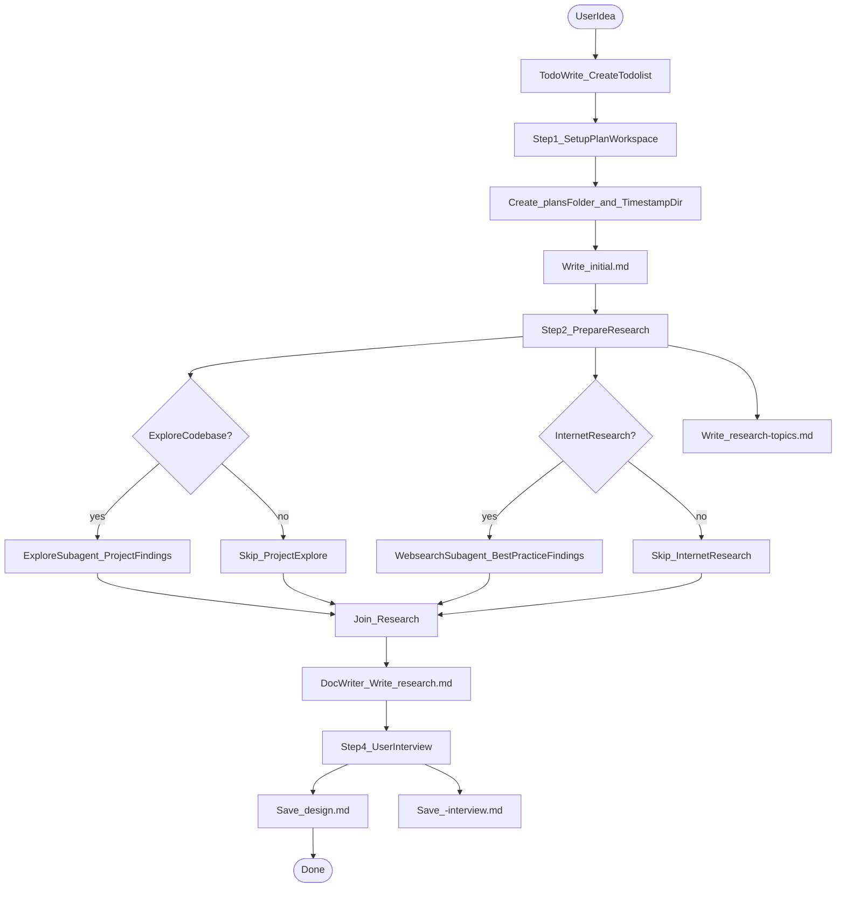

# brainstorm

## 概述

brainstorm 技能帮助用户把一个想法转变转变为更详细的 design 文档. 

## 流程图



## 强制的工作流程

按照下面的内容，使用 todowrite 工具，严格按顺序创建一个 todolist。

### Step 1: 检查 brainstorm 的设置

1. 检查项目目录下是否有 `docs/plans` 这个文件夹，如果没有则创建。
2. 在 `docs/plans` 中创建 `YYYY-MM-DD-HH-MM` 的文件夹。
3. 记录用户最初输入的内容，并将其记录在 `docs/plans/YYYY-MM-DD-HH-MM/initial.md`

**重要**：这里的 `YYYY-MM-DD-HH-MM` 就是这次 brainstorm 的文件夹，所有的内容都会放在这里。

### Step 2: research 前的准备

1. 决定你是否要研究项目中的内容。对用户进行提问，
```
问题: "我是否需要探索已有的代码库中的内容"
选项 A: 请探索现在的代码库中的内容。
选项 B: 不用探索。
```
用户可以输入选项 A，或者 B。或者自己输入一个想法。此时你需要用 question tool 进行提问。

2. 决定你是否要探索互联网中的内容。你要针对用户的问题来思考有哪些问题需要进行探索，然后问他一个多选题。你应当提供 2-4 个选项。下面是输出格式。此时你需要用 question tool 进行提问。
```
问题: "我应该在互联网中进行下列关于哪些内容的探索？"
选项 A: [Topic 1]. [Reason why need research on topic 1].
选项 B: [Topic 2]. [Reason why need research on topic 2].
选项 C: [Topic 3]. [Reason why need research on topic 3].
选项 D: 不用探索。
```
用户可以输入单个选项，或者多个选项。或者自己输入参考的网站。 

3. 整理你得到的回答记录。请记录在 `docs/plans/YYYY-MM-DD-HH-MM/research-topics.md` 中。

### Step 3: research

1. 根据你在 Step 2 中得到的回答，分别进行下面的步骤。注意，2 和 3 是通过 subagent 并行执行的。
2. （如果需要）进行项目内探索。你需要探索
   - 项目内现有的模式（existing patterns/conventions）
   - 项目中的领域知识文档（domain knowledge）。
   - 最近的提交。
   
   请使用一个 explore 的 subagent，进行项目内探索。你的最终目的是为了在 research.md 中书写 `Project Findings` 的内容。

3. （如果需要）互联网研究。搜索互联网中
   - 关于这个问题的常见做法、最佳实践、sota 
   - 当你需要查阅文档时，优先官方文档，避免二手资料。

   使用一个 websearch subagent 来进行互联网搜索。你的最终目的是为了在 research.md 中书写 `Best Practice Findings` 的内容。

4. 你应当已经使用了使用 subagent 并行执行这前两个研究步骤。并等待这两个 subagent 结束。
5. 使用一个 doc-writer subagent 来输出 research 的报告到 `docs/plans/YYYY-MM-DD-HH-MM/research.md` 中。research 的格式详见：`references/research-template.md`。

**原则**
- 获取相关文档页面，收集关键事实（API、限制、最佳实践、版本说明）
- 若参考 URL 不可用，查找官方替代来源并标注不确定性。此时你应当使用 websearch 工具。

### Step 4: 参考 `brainstorm-interview.md` 中的内容对用户访谈 interview

请参考 `references/brainstorm-interview.md` 中的内容对用户进行访谈。

### Step 5: 确保产出被正确保存

Step 4 最终会产出一个 design。会保存在 `docs/plans/YYYY-MM-DD-HH-MM/<topic>-design.md`

作为一个记录的结果，同时会将 interview 的内容保存为采访记录：`docs/plans/YYYY-MM-DD-HH-MM/<topic>-interview.md`


## 完成产出之后

恭喜用户完成了头脑风暴任务。并总结自己的本次的工作内容。

重要：不要询问用户是否要开始实施，等待用户的指令。


