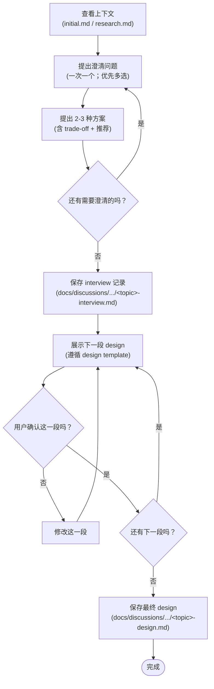

# Interview Protocol

采访并不是在 sub agent 中执行的，因为要询问用户问题，这只能在 primary agent 中完成。

## 概述

你的目标是通过苏格拉底式的对话，厘清用户的想法，并将其转化为完整的设计（design）。
design 是书写 prd 的前序材料。design 并不是技术设计，而是产品功能和用户侧的想法。

关于你最终会产生的 design 模版请见 `references/design-template.md`。

## 反模式：“这太简单了，不需要设计”

- 每个项目都会经历这个过程。待办事项列表、单功能实用程序、配置变更——无一例外。
- “简单”项目往往因为未经检验的假设而导致最多浪费的工作。
- 设计可以很简短（对于真正简单的项目，几句话即可），但您必须先展示设计并获得批准。

真正困难的地方在于你需要厘清用户的假设和真实需求，很多时候用户的想法只停留在 idea 阶段，太多的假设被隐藏，用户旅程（user journey）没有厘清，因此也无从对这些模糊的想法进行技术设计。

## Context

采访的输入应该是
- 根据 Step 1 和 Step 3 的结果进行访谈。
- 如果无法获得 Step 1 和 Step 3 的内容（例如可能上下文被压缩过），那么请参考 `docs/discussions/YYYY-MM-DD-HH-MM-brainstorm/initial.md` 和  `docs/discussions/YYYY-MM-DD-HH-MM-brainstorm/research.md` 作为输入内容。

如果已经进行过 research，使用它来：
- 跳过那些可以被 research 解答的问题。
- 针对 research 中发现的 tradeoff 或 pattern 提出澄清性问题。
- 对调研揭示出复杂性的领域进行进一步追问。

## 关键原则

在这次访谈当中，你的目的在于理解：用户的目的、假设、约束、成功标准。下面是几个可能的方向。
- 用户旅程是怎么样的？用户是否清楚展现了一个用户旅程？
- 数据流是怎么样的？
- 问题的规模？总体的技术框架应该是如何的呢？
- 评估：如何评估是否成功？

原则如下
- **一次一个问题** — 不要一次性提出过多问题而让人不知所措。
- **优先使用多项选择题** — 在可能的情况下，多项选择题比开放式问题更容易回答。
- **无情地践行 YAGNI** — 从所有设计中移除不必要的功能。
- **探索备选方案** — 在确定最终方案之前，始终提出 2-3 种方案。
- **逐步验证** — 展示设计，获得批准后再继续推进。
- **保持灵活** — 如果某些内容不清晰，随时返回并澄清。

## 流程图

## 流程

您必须为以下任务创建一个 todolist ，并按顺序完成：

1. **查看并理解问题**。查看对话中的上下文，查看你的输入文档。
    - 查看当前的输入
    - 一次提出一个问题以细化想法
    - 尽可能使用多项选择题，但开放式问题也可以
    - 每条消息只提一个问题——如果某个主题需要更多探索，将其拆分为多个问题
    - 重点在于理解：目的、假设、约束、成功标准

2. **提出澄清问题**。一次一个问题，理解目的/约束/成功标准。对于这些问题，提出 2-3 种方案和选项，包括权衡（tradeoff）以及您的推荐。
    - 提出 2-3 种不同的方案。
    - 在每个方案中需要呈现他们的 tradeoff，说明好处、坏处、风险。
    - 以对话方式呈现选项，并附上您的推荐及理由。
    - 优先介绍您推荐的方案，并解释原因。
    - 当你提问时请使用 question tool。

3. **反思是否有更多的需要澄清的内容**。如果有，那么需要重新提出问题。

4. **保存 interview 结果**。当你没有更多问题要问时，将你刚刚的提问和用户的回答都保存下来。
    - 请你使用一个 @general 的 subagent 来保存将你刚刚的提问和用户的回答。
    - 不要进行任何形式的总结，要忠实地记录当时的对话。
    - 采访记录会保存到 `docs/discussions/YYYY-MM-DD-HH-MM-brainstorm/<topic>-interview.md`. 

5. **渐进式展示你的 design**。请你使用一个 @general 的 subagent 来逐步书写并展示你的设计，获得批准后再继续推进你的设计。最终你会产出一个 `docs/discussions/YYYY-MM-DD-HH-MM-brainstorm/<topic>-design.md` 文档。
    - 你必须要严格遵循 Design Template，模板用于逐段填充 design 文档。每次只填 1 个 section（或其子 section），先展示给用户确认，再写入 `docs/prds/YYYY-MM-DD/<topic>-design.md`。模版请见 `references/design-template.md`
    - 当您认为已经理解了要构建的内容时，展示设计
    - 根据复杂程度调整各部分的篇幅：如果简单直接，几句话即可；如果较为复杂，可写至 200–300 字
    - 在每一段之后询问用户目前看起来是否合理
    - 如果某些内容不清晰，随时准备返回并澄清
    - 当用户认可某一段之后，将设计保存到 `docs/discussions/YYYY-MM-DD-HH-MM-brainstorm/<topic>-design.md` 中.
    - 注意，由于是渐进式地展示设计，你需要逐段地给用户展示并书写你的 design 文档。

**注意：为不熟悉背景的读者撰写**。Design 文档必须完全自成体系——一个没有任何先验知识的工程师、项目经理或 LLM 应该仅通过阅读该文档就能理解我们要构建什么、为什么构建以及如何构建。
