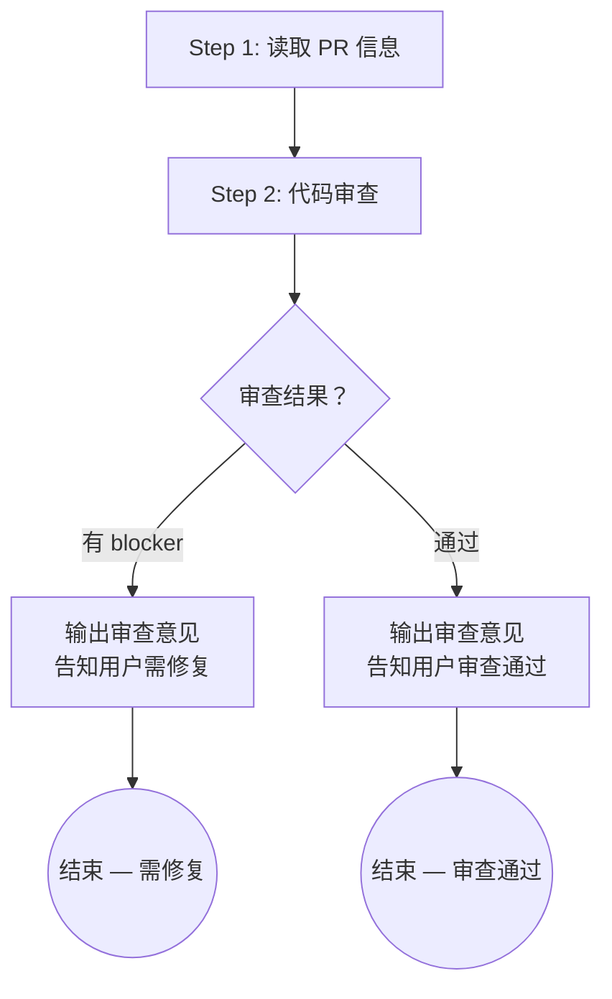

# code-review

## 概述

审查代码变更，识别正确性、架构、安全、可维护性等方面的问题，输出结构化审查意见。

## 流程图



## 强制的工作流程

按照下面的内容，使用 `todowrite` 工具，严格按顺序创建一个 todolist，并在执行过程中持续更新状态。

### Step 1: 读取 PR 信息

**目的**：加载 PR 的完整上下文，为代码审查做准备。

1. 获取 PR 信息：
   - **优先**：使用用户显式提供的 PR 链接或编号
   - **否则**：询问用户 PR 链接或编号
2. 使用 `gh pr view <PR> --json title,body,headRefName,baseRefName,files` 读取 PR 元信息
3. 使用 `gh pr diff <PR>` 获取完整 diff
4. 定位关联的 implementation plan 和 progress.md：
   - 从 PR 描述中查找 plan 引用路径
   - 或从 `docs/plans/` 目录中查找最近的 plan
5. 读取关联文件：
   - implementation plan（技术设计部分 — 架构概览、ADR、编码约定）
   - progress.md（代码实现的 summaries、失败记录、执行过程）
   - tasks.json（了解任务范围和 AC）
6. 输出概要：PR 标题、变更文件数、关联 plan、任务数

### Step 2: 代码审查

**目的**：深入审查 PR 中的代码变更，识别问题。需要一步一步深入思考。如果改动比较简单直接，可以自行选择跳过某些维度。

**审查维度**（按优先级排序）：

1. **理解业务目标**
   - 改动的业务目标是否清晰可理解
   - 如果无法理解改动意图，标记为 warning 并说明

2. **架构合理性**
   - 改动是否放在了合适的位置（模块、目录、文件）
   - 是否尽可能复用已有实现，避免重复造轮子
   - 是否有破坏现有设计与逻辑的风险
   - 是否符合 implementation plan 中的技术设计 / ADR 决策
   - 目录结构是否与 plan 中定义的一致

3. **正确性与 Bug 检查**
   - 代码逻辑是否正确，是否满足 tasks.json 中定义的验收标准（AC）
   - 是否有明显的 bug（空指针、数组越界、资源泄漏、并发问题等）
   - 对于"没有修改"的关联代码，检查是否有遗漏（该改但未改的地方）

4. **安全与健壮性**
   - 输入验证是否充分
   - 错误处理是否恰当（不吞异常、不暴露敏感信息）
   - 是否有硬编码的密钥/凭据

5. **代码清晰度与 KISS**
   - 逻辑是否简洁易懂，命名是否清晰合理
   - 标准：假设一年后再来读这几行代码，是否能轻松理解
   - 是否有不必要的复杂度：无用的定义、过于复杂的逻辑、过多的参数
   - 是否避免了重复造轮子（有现成方案时不应自行实现）

6. **单一职责与代码组织**
   - 每个函数/类是否只做一件事，职责是否明确
   - 控制文件/类/方法的代码行数（函数 >50 行需关注）
   - 模块间耦合是否合理

7. **测试覆盖**
   - 复杂业务逻辑必须有相应测试
   - 不应过度测试：对于没有 if/else/for 等控制逻辑的代码，不需要写测试
   - 一般只对 public 方法写测试
   - 测试是否真正验证了行为（不是总是通过的空测试）

8. **质量检查**（如适用）
   - 切换到 PR 分支：`gh pr checkout <PR>`
   - 运行 implementation plan 中定义的质量检查命令（typecheck / lint / test）
   - 记录结果

9. **可读性检查**
   - 注释是否恰当：复杂或非显而易见的逻辑是否有注释说明"为什么"（而非"做了什么"）；是否有过时、误导性的注释
   - 魔法数字/字符串是否提取为命名常量
   - 代码格式在本次变更范围内是否一致

**审查产出格式**：

对每个有问题的文件，输出：

```
### <文件路径>

- **[blocker]** L42-L55: <问题描述>。建议: <具体建议>
- **[warning]** L78: <问题描述>。建议: <具体建议>
- **[suggestion]** L120: <问题描述>
```

严重级别定义：
- **blocker**: 必须修复才能合并（正确性错误、安全问题、关键测试缺失）
- **warning**: 建议修复但不阻塞合并（代码组织、命名不一致、业务目标不清晰）
- **suggestion**: 可选的改进建议（性能优化、可读性提升）

**审查原则**：

- **审查基于事实**：关注正确性、一致性、测试覆盖等客观维度。不要基于纯风格偏好提出 blocker 级别问题
- **不要仅仅聚焦 diff**：重点审查 PR 的变更内容，需要思考每个文件会给相关的数据流带来怎么样的影响。需要时应当检查上下游链路的代码。

**审查决策**：

- 如有 **blocker** 级别问题：
  1. 输出完整的审查意见
  2. 告知用户需要修复哪些问题
  3. 建议用户修复，然后重新提交审查
  4. **流程结束**

- 如只有 **warning / suggestion**：
  1. 输出审查意见供参考
  2. 告知用户代码审查通过（warning 和 suggestion 不阻塞）

- 如无任何问题：
  1. 告知用户代码审查通过

## 完成产出之后

输出审查结论的中文总结，包含：
- 审查结果（通过 / 需修复）
- 重点问题列表（如有）
- blocker 数量 / warning 数量 / suggestion 数量
