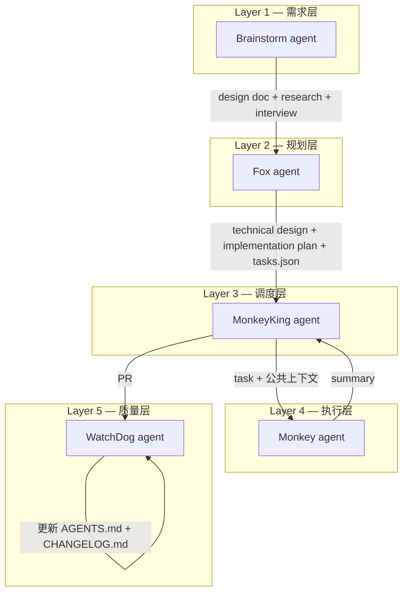
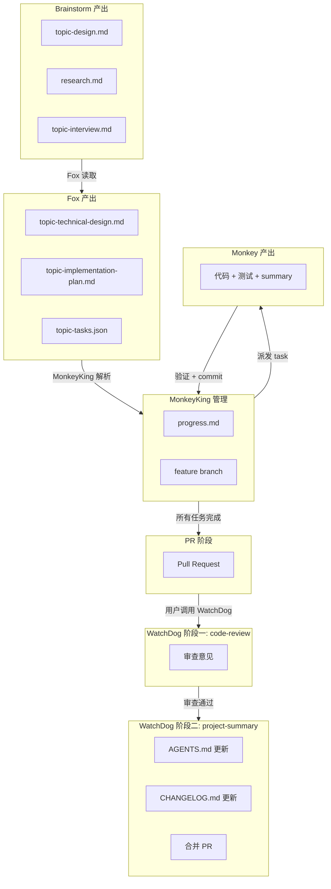

# 开发流水线概览（Development Workflow）

本文档描述本项目采用的多层 agent 开发流水线：从用户想法到可运行代码、再到质量保障的完整路径。

---

## 1. 架构概览



**职责分离原则**：

| 层级 | Agent | 回答的核心问题 |
|------|-------|---------------|
| 需求层 | Brainstorm | **做什么、为什么做** — 产品视角 |
| 规划层 | Fox | **怎么做、谁来做** — 技术架构 + 任务拆解 |
| 调度层 | MonkeyKing | **什么时候做** — 按顺序派发任务 |
| 执行层 | Monkey | **写代码** — TDD 驱动的实现 |
| 质量层 | WatchDog | **质量达标吗** — PR review + 文档更新 |

**关键原则**：Plan 只写验收标准（AC），不预写测试代码。TDD 是实现方法论，属于 Monkey agent 的职责。Fox 定义"什么算完成"，Monkey agent 决定"怎么验证完成"。

---

## 2. Agents

### 2.1 Brainstorm（需求层）

- **文件**：[`.opencode/agents/Brainstorm.md`](.opencode/agents/Brainstorm.md)
- **定位**：头脑风暴与需求澄清，将用户想法转化为可确认的 design 文档
- **mode**：primary
- **temperature**：0.5
- **Skills**：[`brainstorm`](.opencode/skills/brainstorm/SKILL.md)、[`writing-clearly-and-concisely`](.opencode/skills/writing-clearly-and-concisely/SKILL.md)
- **输入**：用户的初始想法 / 需求描述
- **产出**：`<topic>-design.md`、`research.md`、`<topic>-interview.md`（存放于 `docs/plans/YYYY-MM-DD-HH-MM/`）
- **Subagent**：`@explore`（只读代码库探索）、`@general`（互联网调研、长文档撰写）
- **生命周期**：一次会话

### 2.2 Fox（规划层）

- **文件**：[`.opencode/agents/Fox.md`](.opencode/agents/Fox.md)
- **定位**：技术领导 + Scrum Master，将 design doc 转化为技术设计和串行可执行的实施计划
- **mode**：primary
- **temperature**：0.3
- **Skills**：[`implementation-planning`](.opencode/skills/implementation-planning/SKILL.md)、[`writing-clearly-and-concisely`](.opencode/skills/writing-clearly-and-concisely/SKILL.md)、[`json-lint`](.opencode/skills/json-lint/SKILL.md)
- **输入**：Brainstorm 阶段产出的 design doc、research、interview
- **产出**：三个文件（详见第 4 节"产物流转"）
  - `<topic>-technical-design.md`（技术设计文档 — 架构、ADR、数据模型、编码约定）
  - `<topic>-implementation-plan.md`（Markdown，面向人类审阅 + Monkey agent 公共上下文）
  - `<topic>-tasks.json`（结构化任务列表，数组顺序即执行顺序）
- **Subagent**：`@explore`（只读代码库探索）、`@general`（长文档撰写与排版）
- **生命周期**：一次会话

### 2.3 MonkeyKing（调度层）

- **文件**：[`.opencode/agents/MonkeyKing.md`](.opencode/agents/MonkeyKing.md)
- **定位**：读取 implementation plan，按 `tasks.json` 的数组顺序逐个派发任务给 Monkey agent，验证完成状态，维护 progress.md，最终创建 PR
- **mode**：primary
- **temperature**：0.2
- **Skills**：[`task-dispatching`](.opencode/skills/task-dispatching/SKILL.md)
- **核心逻辑**：读取 plan → 创建 feature branch → 初始化 progress.md → 串行派发 Monkey → 验证质量检查 → commit → 汇报结果 → 创建 PR
- **Subagent**：`@Monkey`（派发执行任务）、`@explore`（只读代码库探索）
- **生命周期**：持续到一个 implementation plan 的所有 tasks 完成

### 2.4 Monkey（执行层）

- **文件**：[`.opencode/agents/Monkey.md`](.opencode/agents/Monkey.md)
- **定位**：短生命周期的执行者，用 TDD 实现单个 task
- **mode**：subagent（由 MonkeyKing 派发，每次全新上下文）
- **temperature**：0.3
- **Skills**：[`test-driven-development`](.opencode/skills/test-driven-development/SKILL.md)、[`systematic-debugging`](.opencode/skills/systematic-debugging/SKILL.md)
- **输入**：单个 task 描述 + 公共上下文（技术设计、ADR、编码约定、质量检查命令）
- **产出**：代码 + 测试 + summary（成功或失败）
- **工作流**：读取公共上下文 → 读取 task 与 AC → TDD 循环（RED → GREEN → REFACTOR） → 测试失败时触发 systematic-debugging → 3+ 次修复失败则返回失败总结 → 所有 AC 满足后返回成功 summary
- **生命周期**：单个 task
- **不做的事**：不 commit（由 MonkeyKing 验证后 commit）、不超出 task 范围

### 2.5 WatchDog（质量层）

- **文件**：[`.opencode/agents/WatchDog.md`](.opencode/agents/WatchDog.md)
- **定位**：QA 审查 agent，分两阶段工作 — 先审查 PR 代码变更，通过后更新 AGENTS.md（project-context）和 CHANGELOG.md，最终合并 PR
- **mode**：primary
- **temperature**：0.2
- **Skills**：[`code-review`](.opencode/skills/code-review/SKILL.md)（阶段一：代码审查）、[`project-summary`](.opencode/skills/project-summary/SKILL.md)（阶段二：文档更新 + PR 合并）
- **输入**：用户提供的 PR 链接或编号
- **产出**：审查意见 + AGENTS.md 更新 + CHANGELOG.md 更新 + PR 合并
- **触发方式**：用户手动调用，提供 PR 信息
- **工作流**：
  1. 加载 `code-review` skill → 读取 PR 信息 → 逐文件代码审查（正确性、架构合理性、安全性、测试覆盖等） → 输出审查意见
  2. 审查通过后，加载 `project-summary` skill → 更新 AGENTS.md 和 CHANGELOG.md → 询问用户确认后合并 PR
- **Subagent**：`@explore`（只读代码库探索，理解代码变更上下文）
- **不做的事**：不修复代码（发现问题后报告，由用户/MonkeyKing 处理）
- **生命周期**：一个 PR

### 2.6 Agent 对比总览

| 维度 | Brainstorm | Fox | MonkeyKing | Monkey | WatchDog |
|------|-----------|----------|------------|--------|----------|
| 层级 | 需求层 | 规划层 | 调度层 | 执行层 | 质量层 |
| 核心问题 | 做什么、为什么 | 怎么做、谁来做 | 什么时候做 | 写代码 | 质量达标吗 |
| mode | primary | primary | primary | subagent | primary |
| temperature | 0.5 | 0.3 | 0.2 | 0.3 | 0.2 |
| 输入 | 用户想法 | design doc | impl plan | task + 上下文 | PR |
| 产出 | design doc | technical design + impl plan + tasks.json | PR + 完成报告 | 代码 + 测试 + summary | review + 文档更新 |
| skills | brainstorm, writing | impl-planning, writing, json-lint | task-dispatching | tdd, debugging | code-review, project-summary |
| 生命周期 | 一次会话 | 一次会话 | 持续到完成 | 一个 task | 一个 PR |

---

## 3. Skills

| Skill | 用途 | 使用者 | 文件路径 |
|-------|------|--------|---------|
| `brainstorm` | 需求澄清与 design doc 撰写（5 步流程） | Brainstorm agent | [`.opencode/skills/brainstorm/SKILL.md`](.opencode/skills/brainstorm/SKILL.md) |
| `implementation-planning` | 6 步工作流：读取输入 → 代码库探索 → 架构决策访谈 → 技术设计 → 任务拆解与排序 → 生成产出 | Fox agent | [`.opencode/skills/implementation-planning/SKILL.md`](.opencode/skills/implementation-planning/SKILL.md) |
| `test-driven-development` | RED-GREEN-REFACTOR 循环，强制先写失败测试再写实现 | Monkey agent | [`.opencode/skills/test-driven-development/SKILL.md`](.opencode/skills/test-driven-development/SKILL.md) |
| `systematic-debugging` | 多阶段排查：Root Cause 调查 → 模式分析 → 假设验证 → 实施修复 | Monkey agent | [`.opencode/skills/systematic-debugging/SKILL.md`](.opencode/skills/systematic-debugging/SKILL.md) |
| `task-dispatching` | 串行派发 tasks.json 中的任务给 Monkey，管理 progress.md，创建 PR | MonkeyKing agent | [`.opencode/skills/task-dispatching/SKILL.md`](.opencode/skills/task-dispatching/SKILL.md) |
| `writing-clearly-and-concisely` | 写作质量提升（Elements of Style 等） | Brainstorm, Fox | [`.opencode/skills/writing-clearly-and-concisely/SKILL.md`](.opencode/skills/writing-clearly-and-concisely/SKILL.md) |
| `code-review` | 逐文件审查代码变更，输出结构化审查意见（blocker/warning/suggestion） | WatchDog agent | [`.opencode/skills/code-review/SKILL.md`](.opencode/skills/code-review/SKILL.md) |
| `project-summary` | 更新 AGENTS.md（project-context）和 CHANGELOG.md，合并 PR | WatchDog agent | [`.opencode/skills/project-summary/SKILL.md`](.opencode/skills/project-summary/SKILL.md) |
| `json-lint` | 使用 jsonlint 检查和格式化 JSON 文件 | Fox agent | [`.opencode/skills/json-lint/SKILL.md`](.opencode/skills/json-lint/SKILL.md) |
| `dev-workflow-wiki` | 回答开发流水线相关问题（混合策略） | 任何需要了解流水线的场景 | [`.opencode/skills/dev-workflow-wiki/SKILL.md`](.opencode/skills/dev-workflow-wiki/SKILL.md) |

---

## 4. 产物流转



### 4.1 Brainstorm → Fox

Brainstorm 产出保存在 `docs/plans/YYYY-MM-DD-HH-MM/`：

| 文件 | 内容 |
|------|------|
| `<topic>-design.md` | 产品设计文档（一句话总结、背景、目标/非目标、User Stories、MVP 范围、风险等） |
| `research.md` | 互联网调研结果（技术方案、竞品分析、参考 URL） |
| `<topic>-interview.md` | 苏格拉底式访谈记录 |

详见 [brainstorm SKILL.md](.opencode/skills/brainstorm/SKILL.md)。

### 4.2 Fox → MonkeyKing

Fox 产出保存在同一讨论目录：

| 文件 | 格式 | 消费者 |
|------|------|--------|
| `<topic>-technical-design.md` | Markdown | 人类审阅 + 技术方案统一（架构、ADR、数据模型、编码约定） |
| `<topic>-implementation-plan.md` | Markdown | 人类审阅 + Monkey agent 公共上下文 |
| `<topic>-tasks.json` | JSON | MonkeyKing 解析调度（数组顺序即执行顺序） |

`tasks.json` 中每个 task 包含：`id`、`title`、`priority`（P0/P1/P2）、`depends_on`（可选）、`user_story`、`description`、`files`（create/modify/test）、`acceptance_criteria`、`tech_notes`。数组顺序即串行执行顺序。

详见 [implementation-planning SKILL.md](.opencode/skills/implementation-planning/SKILL.md) 和 [tasks-json-schema.md](.opencode/skills/implementation-planning/references/tasks-json-schema.md)。

### 4.3 MonkeyKing → Monkey

MonkeyKing 按 [monkey-prompt-template.md](.opencode/skills/task-dispatching/references/monkey-prompt-template.md) 模板构建 Monkey agent 的 prompt，包含：
- **公共上下文**：从 `implementation-plan.md` 的技术设计部分提取（架构概览、相关 ADR、目录结构、编码约定）
- **任务描述**：按 `tasks.json` 数组顺序，逐个派发任务的完整内容（描述、文件清单、AC、技术备注）
- **质量检查命令**：typecheck / lint / test 的具体命令

详见 [task-dispatching SKILL.md](.opencode/skills/task-dispatching/SKILL.md)。

### 4.4 Monkey 产出

Monkey agent 在当前代码库中工作，产出代码 + 测试 + summary。summary 包含两种格式：
- **成功 summary**：完成内容、修改的文件、AC 验证结果、质量检查结果
- **失败 summary**：尝试记录、失败原因、建议

Monkey 完成后不自行 commit，而是将 summary 返回给 MonkeyKing。MonkeyKing 验证质量检查后 commit。

详见 [Monkey.md](.opencode/agents/Monkey.md)。

### 4.5 MonkeyKing → PR → WatchDog

所有任务完成后，MonkeyKing 汇报执行结果并创建 PR。用户手动调用 WatchDog agent 并提供 PR 链接或编号进行审查。WatchDog 分两阶段工作：

**阶段一：代码审查**（加载 [code-review](.opencode/skills/code-review/SKILL.md) skill）
- 读取 PR 信息（diff、描述、关联的 implementation plan 和 progress.md）
- 逐文件审查代码变更，关注：业务目标、架构合理性、正确性、安全与健壮性、代码清晰度、单一职责、测试覆盖
- 输出结构化审查意见，按严重级别分为 blocker / warning / suggestion
- 有 blocker 则不合并并输出详细反馈；只有 warning/suggestion 则通过

**阶段二：文档更新与合并**（加载 [project-summary](.opencode/skills/project-summary/SKILL.md) skill）
- 更新目标项目根目录的 `AGENTS.md`（project-context）和 `CHANGELOG.md`
- 询问用户确认后使用 `gh pr merge` 合并 PR

---

## 5. 文件结构

```
.opencode/
├── agents/
│   ├── Brainstorm.md
│   ├── Fox.md
│   ├── MonkeyKing.md
│   ├── Monkey.md
│   └── WatchDog.md
├── skills/
│   ├── brainstorm/
│   │   ├── SKILL.md
│   │   └── references/
│   │       ├── brainstorm-interview.md
│   │       ├── design-template.md
│   │       └── research-template.md
│   ├── code-review/
│   │   └── SKILL.md
│   ├── dev-workflow-wiki/
│   │   ├── SKILL.md
│   │   └── references/
│   │       └── development-workflow.md   ← 本文档
│   ├── implementation-planning/
│   │   ├── SKILL.md
│   │   └── references/
│   │       ├── implementation-plan-template.md
│   │       ├── task-template.md
│   │       ├── tasks-json-schema.md
│   │       └── technical-design-template.md
│   ├── json-lint/
│   │   └── SKILL.md
│   ├── project-summary/
│   │   ├── SKILL.md
│   │   └── references/
│   │       ├── changelog-template.md
│   │       ├── compress-project-summary.md
│   │       └── project-context-template.md
│   ├── systematic-debugging/
│   │   ├── SKILL.md
│   │   └── references/
│   │       ├── condition-based-waiting.md
│   │       ├── defense-in-depth.md
│   │       └── root-cause-tracing.md
│   ├── task-dispatching/
│   │   ├── SKILL.md
│   │   └── references/
│   │       ├── monkey-prompt-template.md
│   │       └── progress-template.md
│   ├── test-driven-development/
│   │   └── SKILL.md
│   └── writing-clearly-and-concisely/
│       ├── SKILL.md
│       ├── elements-of-style/
│       │   ├── 01-introductory.md
│       │   ├── 02-elementary-rules-of-usage.md
│       │   ├── 03-elementary-principles-of-composition.md
│       │   ├── 04-a-few-matters-of-form.md
│       │   └── 05-words-and-expressions-commonly-misused.md
│       └── signs-of-ai-writing.md
```
