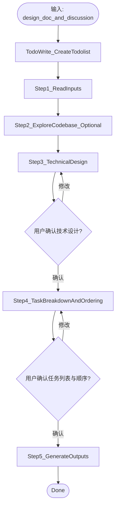

# implementation-planning

## 概述

在开始任何实现（写代码/改配置/改行为）之前，将产品视角的 design 文档转化为统一的技术方案与可调度的任务拆解，作为后续串行开发的输入。

## 流程图



## 强制的工作流程

按照下面的内容，使用 `todowrite` 工具，严格按顺序创建一个 todolist，并在执行过程中持续更新状态。

### Step 1: 读取并理解输入

**目的**：加载 brainstorm 阶段产出的 design doc 与讨论材料，建立公共上下文。

**具体动作**：
1. 定位本次 planning 的输入：
   - **优先**：使用用户显式提供的路径，该路径一般会在 `docs/plans` 文件中，你会在目录中找到 `<topic>-design.md`、`research.md`、`<topic>-interview.md` 等相关文件。
   - **否则**：询问用户本次 planning 的输入是什么。
2. 读取这些文件的内容，并整理要点：
   - 项目一句话目标、MVP 范围、关键约束/假设
   - User Stories（尤其是 P0）
   - 已做过的研究结论（来自 `research.md`）
3. 输出一段简要总结，并向用户确认（避免理解偏差）。

### Step 2: 代码库探索（可选）

**目的**：如果是在已有代码库上开发（棕地项目），需要先理解现有模式与约束，避免技术设计与任务拆解违背项目现实。

**交互**：使用 question tool 询问用户：

```
问题: "这是一个全新项目还是在已有代码库上开发？"
选项 A: 全新项目（greenfield），跳过代码库探索
选项 B: 在已有代码库上开发（brownfield），请探索现有代码与模式
```

**如果选择 B**，使用 `@explore` subagent（只读）完成：
- 技术栈（语言/框架/构建工具/测试框架）
- 目录结构与模块边界
- 现有编码约定（命名、错误处理、日志、测试组织）
- 可复用的组件/模式（给出证据：文件路径）

将探索发现汇总到技术设计的“开发背景 / 现有约束”部分。

### Step 3: 技术设计（technical design）

**目的**：统一架构与关键技术决策，确保后续开发流程中不会做出互相冲突的实现选择。

**模式判断（轻量 vs 完整）**：
先根据复杂度做初判（如：User Stories 数量、是否前后端分离、是否有外部 API 集成等），然后用 question tool 让用户确认。此时你应当给出你的推荐。

```
问题: "本次 technical design 采用哪种深度？"
选项 A: 轻量模式（跳过「数据模型」「API/接口设计」两节，必要时仅给出最小约定）
选项 B: 完整模式（输出全部 6 节）
```

**输出格式**：严格遵循 `references/technical-design-template.md`。

**Review 策略**：
- 2.1 架构概览、2.2 ADR、2.3 数据模型：每完成一个子部分后展示给用户 review，确认后再继续下一个
- 2.4–2.7（API/接口设计、目录结构、编码约定、数据流）：一次性输出，整体 review
- 对有争议的选型：给出 2–3 个方案 + trade-off + 推荐理由（可能需要引用 `research.md` 的 URL 作为证据，必要时重新进行搜索）

### Step 4: 任务拆解与排序（tasks）

**目的**：将 MVP 拆解为细粒度任务，并按逻辑依赖关系排出串行执行顺序。

**任务粒度标准**（必须同时满足）：
- 单个 LLM agent 在一个 session 内可完成（包含 TDD 循环 + 可能的 debug 时间）
- 产出可独立编译/运行的代码变更（含测试；但 Plan 只写 AC，不预写测试代码）
- 影响文件数 \(create + modify + test\) 建议 ≤ 5–8
- 至少包含 1 条可自动验证的验收标准（AC）

**任务格式**：严格遵循 `references/task-template.md`。

**排序**：基于技术设计（架构、接口、数据流）分析任务间的逻辑依赖，将任务按执行顺序排列。tasks.json 中的数组顺序即执行顺序（第 0 项最先执行）。排序原则：
- 基础设施/初始化任务优先
- 被依赖的任务排在依赖它的任务之前
- 同等条件下，优先级高的任务（P0 > P1 > P2）排在前面

**呈现方式**：将任务列表整体展示给用户（而非逐条确认），同时说明排序理由，便于用户基于全局调整：
- 任务过大：拆分
- 任务过小：合并
- 优先级调整（P0/P1/P2）
- 执行顺序调整

**用户确认后**进入 Step 5。

### Step 5: 生成最终产出（2 个文件）

**目的**：把技术设计 + 任务整合为可被人类审阅与机器调度的最终产物。

**输出位置**：默认保存到目录（`docs/plans/<...>/`），除非用户指定其它目录。

**产出文件**：
1. `<topic>-implementation-plan.md`（纯 Markdown，遵循 `references/implementation-plan-template.md`）
2. `<topic>-tasks.json`（遵循 `references/tasks-json-schema.md`）

保存后，向用户展示摘要（任务总数、执行顺序概览），等待下一步指令。

## 完成产出之后

恭喜用户完成 implementation planning，并总结本次产出内容。

重要：不要主动开始实施 tasks（写代码/改配置/跑命令），等待用户明确指令。

