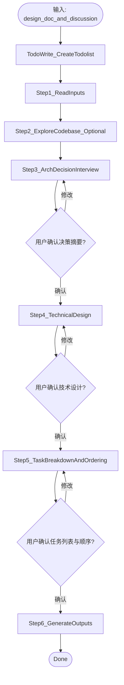

# implementation-planning

## 概述

在开始任何实现（写代码/改配置/改行为）之前，将产品视角的 design 文档转化为统一的技术方案与可调度的任务拆解，作为后续串行开发的输入。

你最终会输出三个文件：
1. `<topic>-implementation-plan.md` — 技术设计 + 任务的整合摘要
2. `<topic>-technical-design.md` — 统一的技术设计文档（架构、ADR、数据模型、编码约定等）
3. `<topic>-tasks.json` — 细粒度任务列表与执行顺序


## 流程图



## 强制的工作流程

按照下面的内容，使用 `todowrite` 工具，严格按顺序创建一个 todolist，并在执行过程中持续更新状态。

### Step 1: 读取并理解输入

**目的**：加载 brainstorm 阶段产出的 design doc 与讨论材料，建立公共上下文。

**具体动作**：
1. 定位本次 planning 的输入：
   - **优先**：使用用户显式提供的路径，该路径一般会在 `docs/plans` 文件中，你会在目录中找到 `<topic>-design.md`、`research.md`、`<topic>-interview.md` 等相关文件。
   - **否则**：询问用户本次 planning 的输入是什么。
2. 读取这些文件的内容，并整理要点：
   - 项目一句话目标、MVP 范围、关键约束/假设
   - User Stories（尤其是 P0）
   - 已做过的研究结论（来自 `research.md`）
3. 输出一段简要总结，并向用户确认（避免理解偏差）。

### Step 2: 代码库探索（可选）

**目的**：如果是在已有代码库上开发（棕地项目），需要先理解现有模式与约束，避免技术设计与任务拆解违背项目现实。

1. 使用 `question tool` 询问用户：

```
问题: "这是一个全新项目还是在已有代码库上开发？"
选项 A: 全新项目（greenfield），跳过代码库探索
选项 B: 在已有代码库上开发（brownfield），请探索现有代码与模式
```

2. **如果选择 A**。进入 Step 3

3. **如果选择 B**，使用 `@explore` subagent（只读）完成：
- 技术栈（语言/框架/构建工具/测试框架）
- 目录结构与模块边界
- 现有编码约定（命名、错误处理、日志、测试组织）
- 可复用的组件/模式（给出证据：文件路径）

4. 将探索发现汇总到技术设计的“开发背景 / 现有约束”部分。

### Step 3: 架构决策访谈

**目的**
在这次访谈当中，你的目的在于和用户讨论并最终决定关键的技术决策。

**步骤**
1. 决定有什么问题需要询问。
   - 你的输入基于 Step 1 的输入（design doc、research）和 Step 2 的代码库探索（如有）
   - 你需要自主分析并列出需要做决策的技术问题清单。
   - 你应当使用 websearch 工具进行互联网的技术搜索最佳实践、流行的框架和一切你认为必要的内容，也可以探索现在的代码库。

2. 提出问题。
   - 一次一个问题。对于这些问题，提出 2-3 种方案和选项，包括权衡（tradeoff）以及您的推荐。
   - 在每个方案中需要呈现他们的 tradeoff，说明好处、坏处、风险。
   - 以对话方式呈现选项，并附上您的推荐及理由。
   - 优先介绍您推荐的方案，并解释原因。
   - 当你提问时请使用 question tool。
   - 将问题按重要程度排序，从最重要的问题开始向用户提问
   - 可能需要引用 `research.md` 的 URL 作为证据，必要时重新进行搜索

3. **反思是否有更多的问题**。如果有，那么需要重新提出问题。
   - 这可能是对用户的回答的澄清
   - 可能是一个 follow up 问题
   - 也可能是之前你想要问但是还没有问的问题。

4. 当你没有更多的问题需要问时，展示一份决策摘要（你的问题和用户的回答），等待用户确认。

**原则**
- **一次一个问题** — 不要一次性提出过多问题而让人不知所措。
- **优先使用多项选择题** — 在可能的情况下，多项选择题比开放式问题更容易回答。
- **无情地践行 YAGNI** — 从所有设计中移除不必要的功能。
- **探索备选方案** — 在确定最终方案之前，始终提出 2-3 种方案。
- **逐步验证** — 展示设计，获得批准后再继续推进。
- **保持灵活** — 如果某些内容不清晰，随时返回并澄清。
- **可以进行探索** - 当你认为你需要进行代码库探索，请使用 @explore 进行代码库探索。当你认为你需要互联网搜索时，请使用 @general websearch tool 进行互联网搜索。

### Step 4: 技术设计（technical design）

**目的**：统一架构与关键技术决策，确保后续开发流程中不会做出互相冲突的实现选择。

1. **模式判断（轻量 vs 完整）**：
先根据复杂度做初判（如：User Stories 数量、是否前后端分离、是否有外部 API 集成等），然后用 question tool 让用户确认。此时你应当给出你的推荐。

```
问题: "本次 technical design 采用哪种深度？"
选项 A: 轻量模式（跳过「数据模型」「API/接口设计」「目录结构」3 节，必要时仅给出最小约定）
选项 B: 完整模式（输出全部 7 节）
```

2. **书写 technical design 文档**。书写技术设计文档。获得批准后再继续推进你的设计。最终你会产出一个 `docs/plans/<YYYY-MM-DD-HH-MM>/<topic>-technical-design.md` 文档。
   - 输出格式需要严格遵循 `references/technical-design-template.md` 模版。模版用于逐段填充 technical design 文档。
   - 当您认为已经理解了要构建的内容时，展示设计
   - 如果某些内容不清晰，随时准备返回并澄清
   - 将设计保存到 `docs/plans/<YYYY-MM-DD-HH-MM>/<topic>-technical-design.md` 中.

**注意**：为不熟悉背景的读者撰写。必须完全自成体系——一个没有任何先验知识的工程师、LLM coding agent 应该仅通过阅读该文档就能理解我们应当如何构建，并可以开始代码工作。

在你完成之后，总结
1. **本次技术设计文档的要点**，以列表的形式展现给用户。并请用户 review 这些要点。
2. 展示本次的 technical design 的保存文件路径。

3. **输出 technical design 文档**。当所有的内容都书写完之后，输出一份 technical-design 文档。保存到 `docs/plans/<YYYY-MM-DD-HH-MM>/<topic>-technical-design.md`.

### Step 5: 任务拆解与排序（tasks）

**目的**：根据文档将本次 plan 的工作拆解为细粒度开发任务，并按逻辑依赖关系排出串行执行顺序。

1. 根据 `<topic>-design.md` 和 `<topic>-technical-design.md` 拆分任务。

**任务粒度标准**（必须同时满足）：
- 单个 LLM agent 在一个 session 内可完成（包含 TDD 循环 + 可能的 debug 时间）
- 产出可独立编译/运行的代码变更（含测试；但 Plan 只写 AC，不预写测试代码）
- 影响文件数 \(create + modify + test\) 建议 ≤ 5–8
- 至少包含 1 条可自动验证的验收标准（AC）

**任务格式**：严格遵循 `references/task-template.md`。

**排序**：基于技术设计（架构、接口、数据流）分析任务间的逻辑依赖，将任务按执行顺序排列。tasks.json 中的数组顺序即执行顺序（第 0 项最先执行）。排序原则：
- 基础设施/初始化任务优先
- 被依赖的任务排在依赖它的任务之前
- 同等条件下，优先级高的任务（P0 > P1 > P2）排在前面

2. **呈现方式**：将任务列表整体展示给用户（而非逐条确认），同时说明排序理由，便于用户基于全局调整：
- 任务过大：拆分
- 任务过小：合并
- 优先级调整（P0/P1/P2）
- 执行顺序调整

3. **用户确认后**。将任务信息保存为 `<topic>-tasks.json`
你需要严格遵循 `references/tasks-json-schema.md` 的格式。

4. **json 检查**。在生成 `json` 之后使用 json-lint skill `skill({ name: "json-lint" })` 进行检查，如果有错误请根据错误修正。

### Step 6: 生成总结文档

**目的**：把技术设计 + 任务整合为可被人类审阅与机器调度的最终产物。

**输出位置**：默认保存到目录（`docs/plans/<YYYY-MM-DD-HH-MM>/`），除非用户指定其它目录。

**产出文件**是`<topic>-implementation-plan.md`（纯 Markdown，遵循 `references/implementation-plan-template.md`）

## 完成产出之后

恭喜用户完成 implementation planning，并总结本次产出内容。

重要：不要主动开始实施 tasks（写代码/改配置/跑命令），等待用户明确指令。

