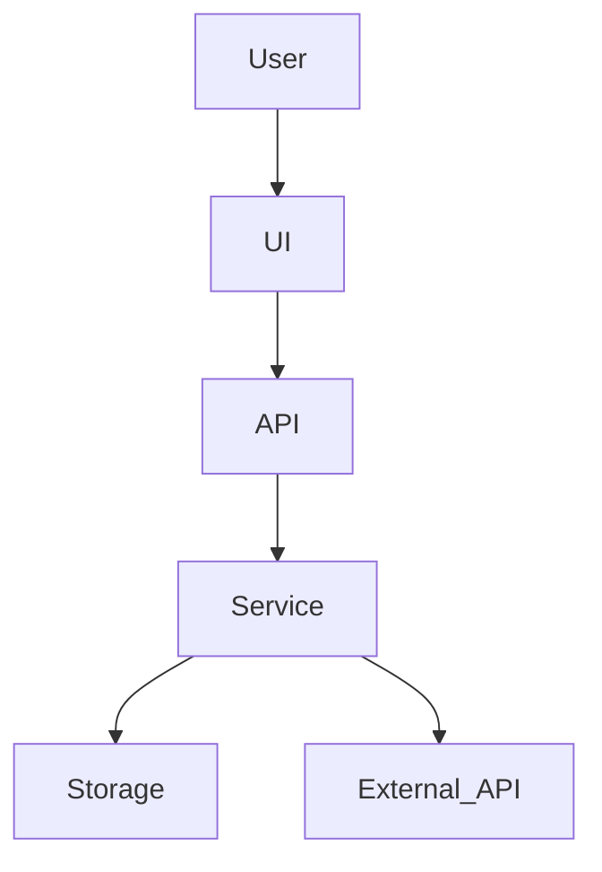
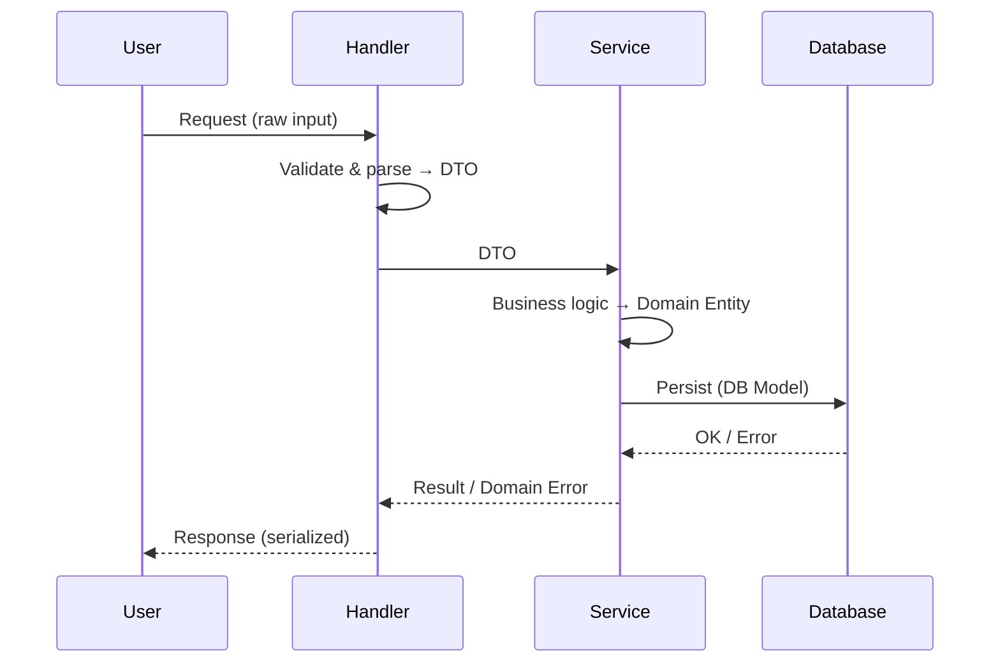

# Technical Design Template（技术设计模板）

以下模板用于 implementation-planning workflow 的 Step 3（技术设计阶段）。每次只输出 1 个 section（或其子 section），先展示给用户确认，再写入最终的 `<topic>-implementation-plan.md`。

## 使用约束

- **自包含**：假设读者对项目背景零了解；技术设计必须可独立理解
- **可追溯**：每个关键决策应能追溯到 design doc 的目标/约束/风险/方案选择，或 `research.md` 的证据
- **先统一再拆任务**：技术设计是所有开发任务时的公共上下文，必须稳定、一致
- **轻量模式**：允许跳过「数据模型」「API/接口设计」，但不得跳过「架构概览」「ADR」「目录结构」「编码约定」

---

````markdown
## 2. 技术设计

### 2.1 架构概览

**目标**：用 1–2 页把系统拆成清晰的模块边界，解释模块如何协作完成用户旅程。

必须包含：
- **分层与组件职责**：每个组件做什么、不做什么
- **组件通信方式**：调用/事件/队列/文件/数据库等
- **关键数据流**：从输入到输出的端到端路径

建议给出一张组件图（示例）：



> 约束：mermaid 节点 ID 不要包含空格；如需复杂标签用双引号包裹。

### 2.2 技术决策记录（ADR）

**目标**：把关键选型的 trade-off 明确落盘，供后续开发时遵循。

每条 ADR 使用以下格式：

#### ADR-001: <决策标题>
- **状态**: 已决定 | 待决定
- **上下文**: 为什么需要做这个决策？来自哪些约束/目标/风险？
- **选项**:
  - A: <方案> — 优点/缺点/风险
  - B: <方案> — 优点/缺点/风险
  - C: <方案> — 优点/缺点/风险（可选）
- **决定**: 选择 <方案>，因为……
- **后果**: 这个决定会带来什么工程影响？（测试方式、目录结构、依赖、性能、安全等）
- **参考**: <URL>  或 design doc 段落引用（可选但推荐）

> ADR 必须包含"为什么不选其它方案"，否则无法约束后续实现分歧。

### 2.3 数据模型（轻量模式可跳过）

**目标**：把 design doc 的"核心对象/数据"技术化，明确实体、关系、存储与生命周期。

建议包含：
- **实体清单**：字段（只列关键字段）、主键/唯一性、约束
- **关系**：1-1 / 1-N / N-N
- **存储方案**：数据库 / 文件 / 内存（source of truth）
- **数据流**：哪些模块读写哪些实体

### 2.4 API/接口设计（轻量模式可跳过）

**目标**：定义模块间契约（contracts），减少开发时的接口碰撞。

建议包含：
- **接口列表**：函数签名 / REST endpoints / events（任选其一或组合）
- **请求/响应结构**：关键字段与错误码/错误类型
- **幂等性与错误处理**：重试策略、超时、降级

### 2.5 目录结构

**目标**：让贡献者知道代码放哪里、为何放那里。

要求：
- 给出树形结构
- 每个目录一句话职责
- 标注：测试文件的组织方式（与生产代码的对应关系）

示例：

```text
src/
  api/        # HTTP handlers / routing
  core/       # domain logic (pure)
  infra/      # IO, persistence, external integrations
tests/
```

### 2.6 编码约定

**目标**：统一开发的写法，降低 code review 成本。

至少覆盖：
- **命名规范**：文件/目录/函数/类的命名约定
- **错误处理**：错误类型、错误码、异常/返回值风格
- **日志与可观测性**：关键事件日志字段、敏感信息处理
- **测试策略**：单测/集成测试边界、测试框架、测试文件命名与放置
- **质量门禁**（可选）：lint/typecheck/format 的要求

### 2.7 数据流（轻量模式可跳过）

**目标**：用端到端视角描述数据如何在系统中流转，帮助开发时理解上下游关系，避免对数据格式和传递方式产生分歧。

建议包含：
- **关键用户旅程的数据流**：选 1–3 条核心 User Story，画出数据从输入到输出经过的模块
- **数据变换**：每经过一个模块/边界时，数据的格式或结构如何变化（e.g. DTO → Domain Entity → Persistence Model）
- **副作用与持久化节点**：标注哪些步骤会写入存储、发送消息、调用外部服务
- **错误路径**：关键失败场景下数据的流向（回滚 / 补偿 / 重试队列等）

建议用 sequence diagram 或 flowchart（示例）：



> 与 2.1 架构概览的区别：架构概览侧重静态的模块边界与职责划分；数据流侧重动态的端到端路径、格式变换与副作用标注。两者互补，不要重复。

---
````
