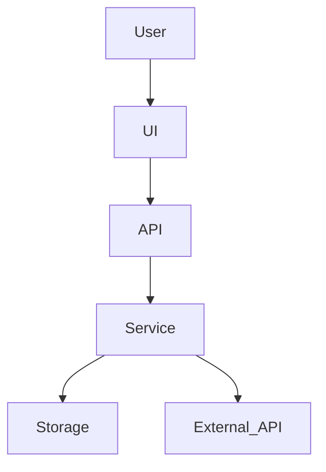

# Technical Design Template（技术设计模板）

以下模板用于 implementation-planning workflow 的 Step 4（技术设计阶段）。每次只输出 1 个 section（或其子 section），先展示给用户确认，再写入最终的 `<topic>-technical-design.md`。

## 使用约束

- **自包含**：假设读者对项目背景零了解；技术设计必须可独立理解
- **可追溯**：每个关键决策应能追溯到 design doc 的目标/约束/风险/方案选择，或 `research.md` 的证据
- **先统一再拆任务**：技术设计是所有开发任务时的公共上下文，必须稳定、一致
- **轻量模式**：允许跳过「数据模型」「API/接口设计」「目录结构」，但不得跳过「架构概览」「ADR」「编码约定」「风险与缓解」

---

````markdown
## 技术设计

### 1. 架构概览

**目标**：用 1–2 页把系统拆成清晰的模块边界，解释模块如何协作完成用户旅程。

#### 1.1 分层与组件职责

**要求**：说明每个组件做什么、不做什么（职责边界）。

（此处填写分层与各组件职责）

#### 1.2 组件通信方式

**要求**：说明组件间如何通信（同步调用 / 事件 / 队列 / 文件 / 数据库等）。

（此处填写通信方式）

#### 1.3 关键数据流

**要求**：从输入到输出的端到端路径，与核心用户旅程对应；可辅以 sequence diagram 或 flowchart。

（此处填写关键数据流描述）

#### 1.4 组件图

**要求**：给出组件图，便于理解模块边界与协作关系。



> 约束：mermaid 节点 ID 不要包含空格；如需复杂标签用双引号包裹。

### 2. 技术决策和选型（ADR）

**目标**：把关键选型的 trade-off 明确落盘，供后续开发时遵循。

每条 ADR 使用以下格式：

#### ADR-001: <决策标题>
- **状态**: 已决定 | 待决定
- **上下文**: 为什么需要做这个决策？来自哪些约束/目标/风险？
- **选项**:
  - A: <方案> — 优点/缺点/风险
  - B: <方案> — 优点/缺点/风险
  - C: <方案> — 优点/缺点/风险（可选）
- **决定**: 选择 <方案>，因为……
- **后果**: 这个决定会带来什么工程影响？（测试方式、目录结构、依赖、性能、安全等）
- **参考**: <URL>  或 design doc 段落引用（可选但推荐）

> ADR 必须包含"为什么不选其它方案"，否则无法约束后续实现分歧。

### 3. 数据模型（轻量模式可跳过）

**目标**：把 design doc 的"核心对象/数据"技术化，明确实体、关系、存储与生命周期。

建议包含：
- **实体清单**：字段（只列关键字段）、主键/唯一性、约束
- **关系**：1-1 / 1-N / N-N
- **存储方案**：数据库 / 文件 / 内存（source of truth）
- **数据流**：哪些模块读写哪些实体

### 4. API/接口设计（轻量模式可跳过）

**目标**：定义模块间契约（contracts），减少开发时的接口碰撞。

建议包含：
- **接口列表**：函数签名 / REST endpoints / events（任选其一或组合）
- **请求/响应结构**：关键字段与错误码/错误类型
- **幂等性与错误处理**：重试策略、超时、降级

### 5. 目录结构

**目标**：让贡献者知道代码放哪里、为何放那里。

要求：
- 给出树形结构
- 每个目录一句话职责
- 标注：测试文件的组织方式（与生产代码的对应关系）

示例：

```text
src/
  api/        # HTTP handlers / routing
  core/       # domain logic (pure)
  infra/      # IO, persistence, external integrations
tests/
```

### 6. 编码约定

**目标**：统一开发的写法，降低 code review 成本。

至少覆盖：
- **命名规范**：文件/目录/函数/类的命名约定
- **错误处理**：错误类型、错误码、异常/返回值风格
- **日志与可观测性**：关键事件日志字段、敏感信息处理
- **测试策略**：单测/集成测试边界、测试框架、测试文件命名与放置
- **质量门禁**（可选）：lint/typecheck/format 的要求

### 7. 风险与缓解（技术层面）

至少列 3 条：

- **R1**：<风险>
  - **影响**：<会导致什么后果>
  - **缓解**：<如何降低风险/如何验证>
- **R2**：
  - **影响**：
  - **缓解**：
- **R3**：
  - **影响**：
  - **缓解**：

---
````
