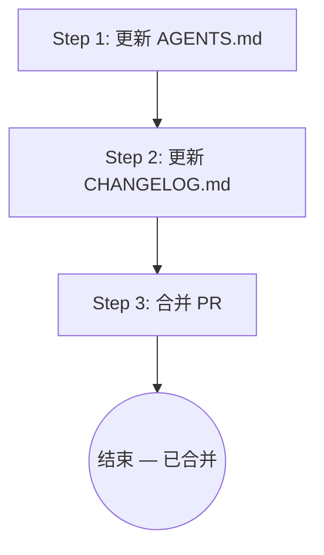

# project-summary

## 概述

在代码审查通过后，更新目标项目的 AGENTS.md（project-context）和 CHANGELOG.md，记录本次 PR 带来的变化，最终合并 PR。

## 流程图



## 强制的工作流程

按照下面的内容，使用 `todowrite` 工具，严格按顺序创建一个 todolist，并在执行过程中持续更新状态。

### Step 1: 更新 AGENTS.md（project-context）

**目的**：更新目标项目的全局项目信息文档，反映本次 PR 带来的变化。

**具体动作**：

1. 确定目标项目的根目录（从 PR 分支 checkout 后的工作目录）
2. 读取 `AGENTS.md`（如不存在，按 `references/project-context-template.md` 模板创建）
3. 基于以下信息源更新各部分：
   - **PR diff**：实际的代码变更
   - **Monkey summaries**（来自 progress.md）：每个 task 做了什么
   - **implementation plan**：技术设计作为参考（但以代码实际状态为准）
4. 逐部分检查是否需要更新：
   - **技术栈**：检查是否新增了语言、框架、依赖（查看 package.json / requirements.txt / go.mod 等的 diff）
   - **质量检查命令**：检查是否有变化（查看 package.json scripts 等的 diff）
   - **关键约束**：检查 implementation plan 中是否声明了跨功能通用的约束
   - **关键实现规则**：从代码中识别非显而易见的项目约定（如"所有 API 调用使用 apiClient 单例"、"错误统一用 AppError 类型"）。只写 agent 从代码片段中推断不出来的规则
   - **目录结构**：如果新增了目录，更新树形结构和职责说明
   - **已完成功能**：追加本次功能（功能名、完成日期、对应 plan 路径）
   - **已知限制与技术债务**：从 Monkey 的 summaries 和 progress.md 中提取（如 "临时用了 mock 数据"、"某个 task 跳过了"）
5. 如果需要更新，那么进行 `AGENTS.md` 的信息更新。
   - 保持精简：遵循 "Focus on the unobvious" 原则。
   - 不要写通用最佳实践（如 "使用有意义的变量名"），只写项目特有的、agent 可能猜不到的内容
6. 检查 `AGENTS.md`, 如果内容超过了 10000 个 token，那说明这个文件的内容太长了，需要进行压缩。如何进行内容压缩请见 `references/compress-project-summary.md`。
7. 更新 frontmatter 中的 `last_updated` 和 `updated_by`
8. 将 AGENTS.md 的更改 commit 到 PR 分支：`git add AGENTS.md && git commit -m "docs: update AGENTS.md (project-context)"`

### Step 2: 更新 CHANGELOG.md

**目的**：记录本次 PR 带来的用户可见变更。

**具体动作**：

1. 读取项目根目录的 `CHANGELOG.md`（如不存在，按 `references/changelog-template.md` 模板创建）
2. 基于 progress.md 中的 task 完成记录和 Monkey summaries，整理变更内容
3. 在文件顶部（`# Changelog` 标题之后）追加新的版本块：

```markdown
## [功能名称] - YYYY-MM-DD

### Added
- TASK-001: <标题> — <一句话描述>
- TASK-002: <标题> — <一句话描述>

### Changed
- （如果修改了已有功能）

### Fixed
- （如果修复了 bug）
```

4. 将 CHANGELOG.md 的更改 commit 到 PR 分支：`git add CHANGELOG.md && git commit -m "docs: update CHANGELOG.md"`
5. 推送更新到远程：`git push`

### Step 3: 合并 PR

**目的**：确认一切就绪后合并 PR。

**具体动作**：

1. 向用户展示本次的摘要：
   - 审查结果（通过 / 有 warning）
   - AGENTS.md 更新内容摘要
   - CHANGELOG.md 更新内容摘要
2. 询问用户是否合并 PR
3. 用户确认后：
   - 使用 `gh pr merge <PR> --merge` 合并 PR
   - 向用户展示合并结果
4. 如果用户不确认，告知用户 PR 保持 open 状态，可以后续再合并

## 完成产出之后

通知用户流程完成，展示：
- PR 合并状态
- AGENTS.md 更新了哪些部分
- CHANGELOG.md 新增了哪些条目
