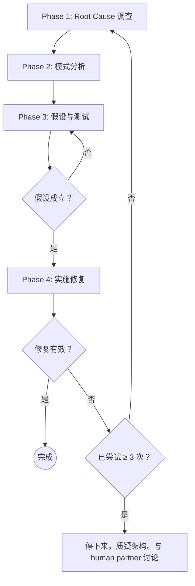

# systematic-debugging

## 概述

我们需要系统级别的 debugging 方法。随机修复浪费时间并引入新 bug。快速的补丁会掩盖根本问题。

**核心原则**：在尝试修复之前，必须先找到 root cause。如果仅仅只是修复 sympton 就等于是一次失败的 fix。

**不遵循这个流程的字面要求，就是在违背 debugging 的精神。**

## 铁律

```
没有 ROOT CAUSE 调查，就不能提出修复方案
```

如果你没有完成 Phase 1，你不能提出任何修复。

## 何时使用

这个技能用于任何技术问题：
- 测试失败
- 生产环境 bug
- 非预期行为
- 性能问题
- 构建失败
- 集成问题

**尤其在以下情况必须使用：**
- 时间紧迫（紧急情况让人倾向于猜测）
- "这只是一个快速修复", "这看起来很明显"
- 你已经尝试了多次修复
- 上一次修复没有起到效果
- 你并没有完全理解问题

**不要跳过以下情况：**
- 问题看起来很简单（简单的 bug 也有 root cause）
- 你正在赶时间（一个非常匆忙的修复往往意味着返工）
- 管理者要求立刻修好（系统化方法比随意的调试更快）

## 流程图



## 四个阶段

你必须完成每个阶段后才能进入下一个。

### Phase 1：Root Cause 调查

**在尝试任何修复之前：**

1. **仔细阅读错误信息**
   - 不要跳过错误（Error）或警告(Warning)
   - 它们经常包含确切的解决方案
   - 完整阅读 stack trace
   - 请注意行号、文件路径、错误码。Note line numbers, file paths, error codes

2. **错误可以重复复现**
   - 你是否可以重复、可靠地触发这个错误？
   - 复线错误的确切步骤是什么？
   - 每次都发生吗？
   - 如果无法复现 → 收集更多数据，不要猜测
   - 如果问题涉及时序或 flaky 测试，参考 `references/condition-based-waiting.md`，尽可能地用条件轮询替代固定超时

3. **检查近期变更**
   - 什么改动可能导致了这个问题？
   - Git diff、最近的 commit
   - 新依赖、配置变更
   - 环境差异

4. **在多组件系统中收集证据**

   **当系统有多个组件时（CI → build → signing，API → service → database）：**

   **在提出修复之前，添加诊断埋点（diagnostic instrumentation）：**
   ```
   对每个组件边界：
     - 记录进入组件的数据
     - 记录离开组件的数据
     - 验证环境/配置的传播
     - 检查每一层的状态

   运行一次，然后收集证据，找出在哪里出了问题
   然后，分析证据确定失败的组件
   然后，调查该特定组件
   ```

   **示例（多层系统）：**
   ```bash
   # Layer 1: Workflow
   echo "=== Secrets available in workflow: ==="
   echo "IDENTITY: ${IDENTITY:+SET}${IDENTITY:-UNSET}"

   # Layer 2: Build script
   echo "=== Env vars in build script: ==="
   env | grep IDENTITY || echo "IDENTITY not in environment"

   # Layer 3: Signing script
   echo "=== Keychain state: ==="
   security list-keychains
   security find-identity -v

   # Layer 4: Actual signing
   codesign --sign "$IDENTITY" --verbose=4 "$APP"
   ```

   **这揭示了**：哪一层失败（secrets → workflow ✓，workflow → build ✗）

5. **Trace Data Flow 追踪数据流**

   **当错误发生在调用栈深处时：**

   参见 `references/root-cause-tracing.md`，了解完整的 backward tracing 技巧。

   **快速版本：**
   - Where does bad value originate? 错误值从哪里来？
   - What called this with bad value? 谁用错误值调用了这个函数？
   - Keep tracing up until you find the source 一直向上追踪直到找到源头
   - Fix at source, not at symptom 在源头修复，而不是在症状处

### Phase 2：模式分析

**在修复之前找到模式：**

1. **找到可工作的示例**
   - 在同一代码库中找到类似的、可工作的代码
   - 请进行比较：可工作的代码 vs 出了问题的代码

2. **对照参考实现**
   - 如果在实现某个模式，完整阅读参考实现
   - 不要略读。一定要逐行阅读代码
   - 在应用之前充分理解该模式

3. **识别差异**
   - 可工作的和出问题的之间有什么不同？
   - 列出每一个差异，无论多小
   - 不要假设"那个不重要"

4. **理解依赖关系**
   - 这需要哪些其他组件？
   - 需要什么设置、配置、环境？
   - 它做了什么假设？

### Phase 3：假设与测试

**科学方法：**

1. **形成单一假设**
   - 清楚地表述："我认为 X 是 root cause，因为 Y"
   - 写下来
   - 要具体，不要含糊

2. **最小化测试**
   - 做出最小的改动来验证假设
   - 一次只改一个变量
   - 不要同时修复多个问题

3. **验证后再继续**
   - 生效了？→ 进入 Phase 4
   - 没生效？→ 形成新的假设
   - 不要在上面堆砌更多修复，一次只假设一件事情

4. **当你不知道时**
   - 明确表示"我不理解 X"
   - 不要假装知道
   - 寻求帮助
   - 做进一步地研究

### Phase 4：实施

**修复 root cause，而不是症状：**

1. **创建失败的测试用例**
   - 最简单的复现
   - 尽可能用自动化测试
   - 如果没有测试框架，用一次性脚本
   - 修复前必须有
   - 使用 `test-driven-development` skill 编写合格的失败测试

2. **实施单一修复**
   - 针对已识别的 root cause
   - 一次只改一处
   - 不要"顺便"改进其他东西
   - 不要捆绑重构

3. **验证修复**
   - 测试通过了？
   - 其他测试没有被破坏？
   - 问题真的被解决了？
   - 修复确认后，参考 `references/defense-in-depth.md` 在多层添加验证，让 bug 在结构上不可能再发生

4. **如果修复无效**
   - 停下来
   - 数一数：你已经尝试了几次修复？
   - 如果 < 3：回到 Phase 1，用新信息重新分析
   - **如果 ≥ 3：停下来质疑架构（见下方第 5 步）**
   - 不要在没有架构讨论的情况下尝试第 4 次修复

5. **如果 3+ 次修复失败：质疑架构**

   **指示架构问题的模式：**
   - 每次修复都揭示出新的共享状态/耦合/不同位置的问题
   - 修复需要"大规模重构"才能实施
   - 每次修复都在其他地方产生新症状

   **停下来质疑根本假设：**
   - 这个模式从根本上合理吗？
   - 我们是否"仅凭惯性在坚持"？
   - 应该重构架构还是继续修复症状？

   **在尝试更多修复之前，与你的 human partner 讨论**

   这不是假设失败——这是架构错误。

## 危险信号 — 请停下来，遵循流程

如果你发现自己在想：
- "先快速修复一下，以后再调查"（推迟 root cause fix）
- "试试改一下 X 看看行不行"（随意尝试，没有尝试寻找 root cause）
- "同时改多个地方，然后跑测试"（随意尝试，没有尝试寻找 root cause）
- "跳过测试，我手动验证"（跳过流程，没有遵循 TDD）
- "大概是 X，让我修一下"（没有尝试寻找 root cause）
- "我不完全理解但这可能行"（没有证据的结论，跳过流程）
- "模式说的是 X 但我换个方式"（跳过流程）
- "主要问题是这些：[列出修复方案但没有调查]" （跳过流程）
- 在追踪数据流之前就提出解决方案。（跳过流程，没有证据的结论）
- **"再试一次修复"（已经尝试了 2+ 次），每次修复都在不同地方揭示新问题**

**以上所有都意味着：停下来。回到 Phase 1。**

**如果 3+ 次修复失败：** 质疑架构（见 Phase 4 和 Phase 5）

## 常见合理化借口

| 借口 | 现实 |
|------|------|
| "问题很简单，不需要流程" | 简单问题也有 root cause。流程对简单 bug 很快。 |
| "紧急情况，没时间走流程" | 系统化调试比瞎猜快得多。 |
| "先试一下，再调查" | 第一次修复定下了模式。从一开始就做对。 |
| "等确认修复有效后再写测试" | 没有测试的修复不可靠。先写测试能证明它有效。 |
| "同时修多个地方省时间" | 无法隔离哪个生效了。会引入新 bug。 |
| "参考文档太长，我改编一下" | 不完整的理解保证出 bug。完整阅读。 |
| "我看到问题了，让我修一下" | 看到症状 ≠ 理解 root cause。 |
| "再试一次修复"（在 2+ 次失败后） | 3+ 次失败 = 架构问题。质疑模式，而不是再修一次。 |

## Quick Reference

| Phase | 关键活动 | 成功标准 |
|------|---------|---------|
| **1. Root Cause** | 阅读错误、复现、检查变更、收集证据 | 理解 WHAT 和 WHY |
| **2. 模式分析** | 找到可工作的示例、对比 | 识别差异 |
| **3. 假设验证** | 形成理论、最小化测试 | 确认假设或形成新假设 |
| **4. 实施** | 创建测试、修复、验证 | Bug 解决，测试通过 |

## 当流程发现"没有 Root Cause"时

如果系统化调查表明问题确实是环境相关、时序相关或外部因素：

1. 你已经完成了流程
2. 记录你调查了什么
3. 实施适当的处理（重试、超时、错误消息）
4. 添加监控/日志以便后续调查

**但是：** 95% 的"没有 root cause"案例是调查不充分。

## References

以下技术是系统化调试的组成部分，可在 `references/` 目录下找到：

- **`references/root-cause-tracing.md`** — 通过调用栈反向追踪 bug，找到原始触发点（Phase 1 Step 5 使用）
- **`references/defense-in-depth.md`** — 在找到 root cause 后，在多个层添加验证（Phase 4 Step 3 修复确认后使用）
- **`references/condition-based-waiting.md`** — 用条件轮询替代固定超时（Phase 1 Step 2 遇到时序/flaky 问题时使用）

## 关联的 skill
- **test-driven-development** — 用于创建失败测试用例（Phase 4 第 1 步）
