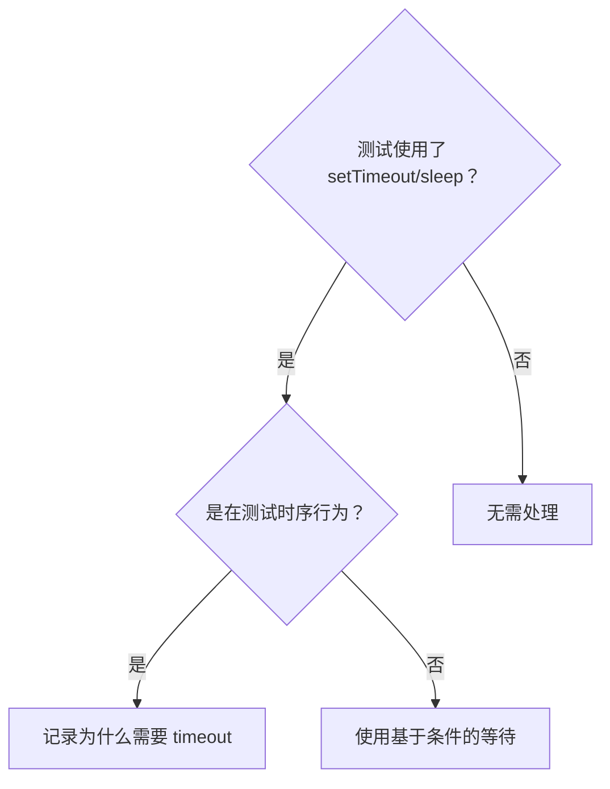

# 基于条件的等待

## 概述

Flaky 测试经常用固定延迟来猜测时序。这会产生竞态条件——在快速机器上通过，在高负载或 CI 中失败。

**核心原则**：等待你真正关心的条件，而不是猜测它需要多长时间。

## 何时使用



**使用场景：**
- 测试中有固定延迟（`setTimeout`、`sleep`、`time.sleep()`）
- 测试不稳定（有时通过，高负载时失败）
- 测试在并行运行时超时
- 等待异步操作完成

**不要使用：**
- 正在测试实际的时序行为（debounce、throttle 间隔）
- 如果必须使用固定 timeout，始终记录原因

## 核心模式

```typescript
// ❌ 之前：猜测时序
await new Promise(r => setTimeout(r, 50));
const result = getResult();
expect(result).toBeDefined();

// ✅ 之后：等待条件
await waitFor(() => getResult() !== undefined);
const result = getResult();
expect(result).toBeDefined();
```

## 速查表

| 场景 | 模式 |
|------|------|
| 等待事件 | `waitFor(() => events.find(e => e.type === 'DONE'))` |
| 等待状态 | `waitFor(() => machine.state === 'ready')` |
| 等待数量 | `waitFor(() => items.length >= 5)` |
| 等待文件 | `waitFor(() => fs.existsSync(path))` |
| 复合条件 | `waitFor(() => obj.ready && obj.value > 10)` |

## 实现

通用轮询函数：
```typescript
async function waitFor<T>(
  condition: () => T | undefined | null | false,
  description: string,
  timeoutMs = 5000
): Promise<T> {
  const startTime = Date.now();

  while (true) {
    const result = condition();
    if (result) return result;

    if (Date.now() - startTime > timeoutMs) {
      throw new Error(`Timeout waiting for ${description} after ${timeoutMs}ms`);
    }

    await new Promise(r => setTimeout(r, 10)); // Poll every 10ms
  }
}
```

在此基础上可以构建领域特定的 helper，伪代码示例：

```
function waitForEvent(source, eventType, timeout):
    return waitFor(
        () => source.getEvents().find(e => e.type == eventType),
        "event: " + eventType,
        timeout
    )

function waitForEventCount(source, eventType, count, timeout):
    return waitFor(
        () => source.getEvents().filter(e => e.type == eventType).length >= count,
        count + " x " + eventType,
        timeout
    )

function waitForEventMatch(source, predicate, description, timeout):
    return waitFor(
        () => source.getEvents().find(predicate),
        description,
        timeout
    )
```

## 常见错误

**❌ 轮询太快**：`setTimeout(check, 1)` — 浪费 CPU
**✅ 修复**：每 10ms 轮询一次

**❌ 没有超时**：条件永不满足时无限循环
**✅ 修复**：始终包含带有清晰错误信息的超时

**❌ 数据过期**：在循环之前缓存了状态
**✅ 修复**：在循环内调用 getter 获取最新数据

## 何时固定 Timeout 是正确的

```typescript
// 工具每 100ms tick 一次 — 需要 2 次 tick 来验证部分输出
await waitForEvent(manager, 'TOOL_STARTED'); // 首先：等待条件
await new Promise(r => setTimeout(r, 200));   // 然后：等待已知的时序行为
// 200ms = 100ms 间隔的 2 次 tick — 有文档说明且有根据
```

**固定 Timeout 的要求：**
1. 先等待触发条件
2. 基于已知的时序（不是猜测）
3. 注释说明为什么

