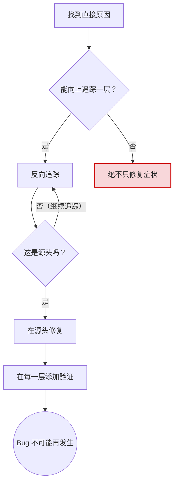

# Root Cause 追踪

## 概述

Bug 通常在调用栈深处暴露。你的本能是在错误出现的地方修复，但那是在治疗症状，并没有从根本上解决问题。

**核心原则**：沿调用链反向追踪，直到找到原始触发点，然后在源头修复。

## 何时使用

- 错误发生在执行深处（不是入口点）
- Stack trace 显示长调用链
- 不清楚无效数据从哪里来
- 需要找到哪个测试/代码触发了问题

## 流程图



**绝不只在错误出现的地方修复。** 反向追踪，找到原始触发点。

## 强制的工作流程

### Step 1. 观察症状
观察错误信息的完整内容——错误类型、消息、发生位置。

```
你观察到了什么？
  → 错误信息是什么？
  → 在哪个文件/函数中发生的？
  → 错误值是什么？
```

### Step 2. 找到直接原因
定位到**直接产生错误的那一行代码**。不要急着修复，只是确认"是哪行代码出了问题"。

### Step 3. 问：谁调用了这个错误代码？
从直接原因出发，沿调用链向上追踪。列出完整的调用路径：

```
functionC(badValue)           ← 错误在这里暴露
  → called by functionB()
  → called by functionA()
  → called by entryPoint()    ← 源头可能在这里
```

### Step 4. 继续向上追踪
在调用链的每一层，检查：
- 传入的参数值是什么？是否已经是错误的？
- 这个值是从哪里来的（参数传递？全局状态？配置？）
- 在哪一层，值从"正确"变成了"错误"？

### Step 5. 找到原始触发点
一直追踪到值**第一次变成错误**的那个地方。那才是 root cause——在那里修复，而不是在症状暴露处。

## 添加 Stack Trace

当你无法手动追踪时，在可疑操作前添加诊断埋点。下面是一段伪代码

```
function suspiciousOperation(input):
    stack = capture current call stack
    log.debug("About to execute operation", {
        input: input,
        cwd: current working directory,
        env: relevant environment variables,
        stack: stack,
    })
    // ... execute operation
```

**关键原则：**
- 在危险操作**之前**记录日志，而不是在它失败之后
- 在测试中使用 stderr 输出或者输出日志到文件
- 包含上下文信息：输入值、工作目录、环境变量、调用栈

**运行并捕获**：执行测试，过滤出你的诊断日志，分析：
- 哪个测试/调用者触发了问题？
- 传入的值是什么？
- 是否有规律（同一个调用者？同一个参数？）

## 找到哪个测试造成了污染

如果某些东西在测试期间出现，但你不知道是哪个测试导致的：

使用下面的脚本是一个例子，你可以用来找到污染的测试文件：

```Bash
#!/usr/bin/env bash
# Script to find which test creates unwanted files/state
# Usage: ./find-polluter.sh <file_or_dir_to_check> <test_pattern>
# Example: ./find-polluter.sh '.git' 'src/**/*.test.ts'

set -e

if [ $# -ne 2 ]; then
  echo "Usage: $0 <file_to_check> <test_pattern>"
  echo "Example: $0 '.git' 'src/**/*.test.ts'"
  exit 1
fi

POLLUTION_CHECK="$1"
TEST_PATTERN="$2"

echo "🔍 Searching for test that creates: $POLLUTION_CHECK"
echo "Test pattern: $TEST_PATTERN"
echo ""

# Get list of test files
TEST_FILES=$(find . -path "$TEST_PATTERN" | sort)
TOTAL=$(echo "$TEST_FILES" | wc -l | tr -d ' ')

echo "Found $TOTAL test files"
echo ""

COUNT=0
for TEST_FILE in $TEST_FILES; do
  COUNT=$((COUNT + 1))

  # Skip if pollution already exists
  if [ -e "$POLLUTION_CHECK" ]; then
    echo "⚠️  Pollution already exists before test $COUNT/$TOTAL"
    echo "   Skipping: $TEST_FILE"
    continue
  fi

  echo "[$COUNT/$TOTAL] Testing: $TEST_FILE"

  # Run the test
  npm test "$TEST_FILE" > /dev/null 2>&1 || true

  # Check if pollution appeared
  if [ -e "$POLLUTION_CHECK" ]; then
    echo ""
    echo "🎯 FOUND POLLUTER!"
    echo "   Test: $TEST_FILE"
    echo "   Created: $POLLUTION_CHECK"
    echo ""
    echo "Pollution details:"
    ls -la "$POLLUTION_CHECK"
    echo ""
    echo "To investigate:"
    echo "  npm test $TEST_FILE    # Run just this test"
    echo "  cat $TEST_FILE         # Review test code"
    exit 1
  fi
done

echo ""
echo "✅ No polluter found - all tests clean!"
exit 0
```

逐个运行测试，在第一个污染者处停止。

请注意：
- 这个脚本只是一个例子，是针对 node.js/npm 项目的。
- 如果要用于其他语言的项目，或者项目中有别的语言：
    - 需要把 npm test 替换为对应的测试命令（如 pytest、go test 等）。
    - 需要修改对应的文件后缀。你可以传入任何 find -path 支持的模式，例如：`'src/**/*.test.js'`, `'tests/**/*.py'`, `'**/*_test.go'`

## 真实案例：空 projectDir

**症状**：`.git` 被创建在 `packages/core/`（源代码目录）

**追踪链：**
1. `git init` 在 `process.cwd()` 中运行 ← 空的 cwd 参数
2. WorktreeManager 被传入空的 projectDir
3. Session.create() 传递了空字符串
4. 测试在 beforeEach 之前访问了 `context.tempDir`
5. setupCoreTest() 初始时返回 `{ tempDir: '' }`

**Root cause**：顶层变量初始化时访问了空值

**修复**：将 tempDir 改为 getter，在 beforeEach 之前访问会抛出异常

**同时添加了 defense-in-depth：**
- Layer 1：Project.create() 验证目录
- Layer 2：WorkspaceManager 验证不为空
- Layer 3：NODE_ENV 守卫拒绝在 tmpdir 之外执行 git init
- Layer 4：git init 之前记录 stack trace
