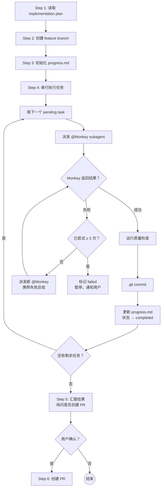

# task-dispatching

## 概述

读取 implementation plan 与 tasks.json，按任务顺序逐个派发给实际执行的代码实现的 subagent 执行，验证每个任务的完成状态，维护全局 progress.md，最终创建 PR。

## 流程图

## 强制的工作流程

按照下面的内容，使用 `todowrite` 工具，严格按顺序创建一个 todolist，并在执行过程中持续更新状态。

### Step 1: 读取 implementation plan

**目的**：加载 implementation plan，建立公共上下文。

**具体动作**：
1. 定位本次执行的输入：
   - **优先**：使用用户显式提供的路径
   - **否则**：询问用户 implementation plan 和 tasks.json 的位置
2. 读取 `<topic>-implementation-plan.md`，提取公共上下文：
   - 架构概览
   - 相关 ADR（架构决策记录）
   - 目录结构
   - 编码约定
   - 质量检查命令（typecheck、lint、test、build 的具体命令）
3. 读取 `<topic>-tasks.json`，确认任务总数和执行顺序

### Step 2: 创建 feature branch

**目的**：为本次 implementation plan 创建独立的 feature branch。

**具体动作**：
1. 检查当前分支是否为默认分支（默认分支一般为 main 分支）。如果不是，那么需要切换到默认分支并且拉取最新的改动。
2. 从默认分支创建 `feature/<topic>` 分支
3. 切换到新分支
4. 验证分支创建成功（`git branch --show-current`）

### Step 3: 初始化 progress.md

**目的**：创建全局进度文件，记录所有任务的执行状态。

**具体动作**：
1. 在 `docs/plans/<...>/` 创建 `progress.md`，格式遵循 `references/progress-template.md`
2. 填入：分支名称、plan 名称、任务总数、开始时间
3. 将所有任务初始状态设为 pending

### Step 4: 串行执行任务

**目的**：按 tasks.json 数组顺序，逐个派发任务给 Monkey subagent，验证结果。

这是本 skill 的核心循环。对每个任务执行以下流程：

#### 4.1 准备

1. 更新 progress.md：当前任务状态 → `in_progress`，记录开始时间
2. 按 `references/monkey-prompt-template.md` 构建 Monkey subagent 的 prompt，包含：
   - 公共上下文（Step 1 提取的技术设计），并包含完整的文件目录
   - 当前 task 的完整描述（从 tasks.json 中提取：id、title、description、files、acceptance_criteria、tech_notes）
   - 质量检查命令
   - 如果是重试：附加之前所有失败尝试的 summary

#### 4.2 派发

派发 `@Monkey` subagent。每次派发创建全新子会话（Monkey 已自带 test-driven-development + systematic-debugging skill）。

#### 4.3 检查结果

Monkey 返回后，检查其 summary：

**如果成功**（summary 状态为"成功"）：

1. 运行质量检查命令（typecheck、lint、test），确认全部通过
2. 如果质量检查失败：视为任务失败，进入重试流程
3. 如果质量检查通过：
   - `git add` 相关文件
   - `git commit`，commit message 格式：`feat(<topic>): <task-id> <task-title>`
   - 更新 progress.md：状态 → `completed`，记录 Monkey 的 summary

**如果失败**（summary 状态为"失败"，或 Monkey 未能完成）：

1. 更新 progress.md：记录本次失败原因（来自 Monkey 的失败总结）
2. 检查已尝试次数：
   - **< 3 次**：派发新的 `@Monkey` subagent（全新上下文），prompt 中附加之前所有失败尝试的总结
   - **≥ 3 次**：标记任务为 `failed`，暂停执行，通知用户并等待指令

#### 4.4 用户介入（仅在任务 failed 时）

当任务被标记为 `failed` 后，等待用户指令：

- 用户可以选择跳过该任务，继续执行后续任务
- 用户可以选择手动修复后继续
- 用户可以选择终止整个 plan

### Step 5: 汇报结果并询问是否要创建 PR

**目的**：向用户展示执行结果，询问是否创建 PR。

**具体动作**：
1. 往 `progress.md` 中写入 `总结` 部分。
2. 展示最终 progress.md 摘要
3. 报告：
   - `progress.md` 中的总结内容
   - 完成任务数 / 总任务数
   - 失败任务数（如有）及原因
4. 如有失败任务，列出失败原因和建议
5. 询问用户是否要创建 PR

### Step 6: 创建 PR（用户确认后）

**目的**：推送分支并创建 PR。

**具体动作**：

1. 推送 feature branch 到远程：`git push -u origin feature/<topic>`
2. 使用 `gh pr create` 创建 PR，内容包含：
   - **标题**：`feat: <topic>`
   - **描述**：
     - 功能概述（来自 implementation plan）
     - 完成的 task 列表（id + title + 状态）
     - 质量检查结果汇总
3. 向用户展示 PR 链接

## 完成产出之后

通知用户所有任务已完成（或部分完成），展示 PR 链接，等待用户下一步指令。
